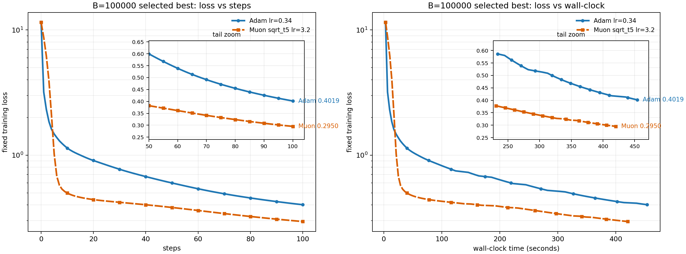
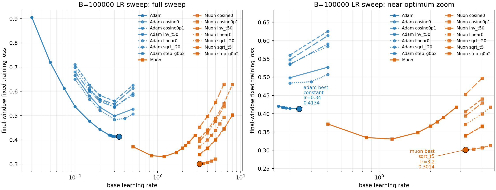
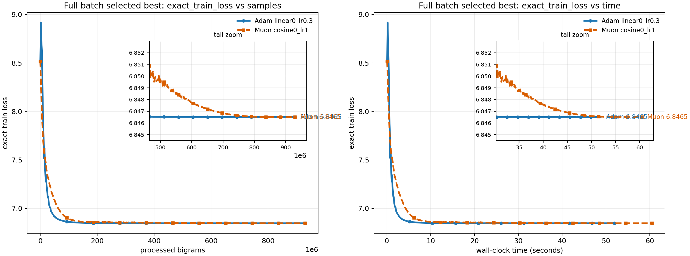
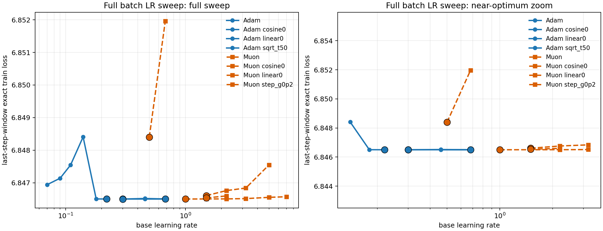

# Full-Batch Adam vs Muon：Gaussian AM 与 PTB 线性模型

这个仓库展示两个 full-batch softmax 优化实验中 **full Adam** 与 **full Muon** 的对比：

1. **Gaussian Associative Memory**
2. **PTB Linear Bigram Softmax**

核心问题是：

> 在没有 minibatch noise 的 full-batch 设置下，Muon 相对 Adam 的优势是否稳定存在？

结论很直接：**Gaussian Associative Memory 上 Muon 反而明显优于 Adam；PTB linear bigram 上二者几乎打平，Adam 有极小数值优势。** 也就是说，对于完全体的Muon和Adam, bigram model可能并不能够解释Full-Muon的benefit。

## 仓库内容

```text
github_full_batch_adam_muon
├── README.md
└── figures
    ├── gaussian_best_loss_full_batch.png
    ├── gaussian_lr_sweep_full_batch.png
    ├── ptb_best_train_loss_full_batch.png
    └── ptb_lr_sweep_full_batch.png
```

本仓库只保留四张关键图和这一份详细说明：

| 文件 | 内容 |
|---|---|
| `figures/gaussian_best_loss_full_batch.png` | Gaussian AM 中最佳 Adam 与最佳 Muon 的 full-batch train loss 曲线 |
| `figures/gaussian_lr_sweep_full_batch.png` | Gaussian AM 的 optimizer / LR / schedule sweep 汇总 |
| `figures/ptb_best_train_loss_full_batch.png` | PTB 中最佳 Adam 与最佳 Muon 的 full-batch train loss 曲线 |
| `figures/ptb_lr_sweep_full_batch.png` | PTB 的 optimizer / LR / schedule sweep 汇总 |

没有保留逐步日志、完整 sweep 表、缓存文件或中间分析图；关键数字直接写在本文中。

## 总览结果

| 任务 | Adam best final train loss | Muon best final train loss | Adam - Muon | 结论 |
|---|---:|---:|---:|---|
| Gaussian AM | `0.401851` | `0.295026` | `+0.106825` | Muon 明显更低 |
| PTB linear bigram | `6.846499938` | `6.846500079` | `-0.000000140` | 基本打平，Adam 极小领先 |

两个实验的差异非常明显：

- Gaussian AM：Muon 的最终训练 loss 比 Adam 低约 `26.6%`，并且更快达到 Adam 的最终 loss 水平。
- PTB：训练 loss 差距只有 `1e-7` 量级，不应解释成强分离。

## 共同实验原则

### Full-Batch Definition

这里的 full-batch 指每一个 optimization step 都使用完整目标分布计算梯度，而不是从样本中抽 minibatch。

因此实验比较的是：

```text
full Adam vs full Muon
```

而不是：

```text
stochastic Adam vs stochastic Muon
```

这个设置有两个好处：

1. 排除 minibatch 抽样噪声对曲线形状和最终 loss 的影响。
2. 更直接地比较 Adam 的 coordinate-wise adaptive update 与 Muon 的 matrix-direction update 在确定性目标上的优化行为。

### 参数矩阵

两个任务都优化一个矩阵参数：

```text
W in R^{d x d}
```

模型 logits 都可以写成：

```text
score_y(x; W) = u_y^T W v_x
```

其中：

- `v_x` 是输入 token / query 的表示；
- `u_y` 是输出 class 的表示；
- `W` 是唯一需要训练的矩阵参数；
- softmax 在所有候选输出 `y` 上计算。

### Full Adam

Adam 使用标准一阶矩和二阶矩估计。设 full-batch 梯度方向为 `g_t`，更新为：

```text
m_t = beta1 * m_{t-1} + (1 - beta1) * g_t
v_t = beta2 * v_{t-1} + (1 - beta2) * g_t^2

mhat_t = m_t / (1 - beta1^t)
vhat_t = v_t / (1 - beta2^t)

W_{t+1} = W_t + lr_t * mhat_t / (sqrt(vhat_t) + eps)
```

本实验中 Adam 超参数为：

| 参数 | 数值 |
|---|---:|
| `beta1` | `0.9` |
| `beta2` | `0.999` |
| `eps` | `1e-8` |
| weight decay | `0` |

这里的 `g_t` 按照“降低 loss 的方向”记号书写，所以更新式里是 `+ lr_t * direction`。若把梯度定义成 `nabla L(W_t)`，则等价写法是沿 `-nabla L(W_t)` 更新。

### Full Muon

Muon 对矩阵梯度先做 momentum，再取极分解方向。设 full-batch 梯度方向为 `g_t`：

```text
B_t = momentum * B_{t-1} + g_t
P_t = polar(B_t)
W_{t+1} = W_t + lr_t * P_t
```

其中 `polar(B_t)` 是矩阵 `B_t` 的 polar factor。如果：

```text
B_t = U S V^T
```

则：

```text
polar(B_t) = U V^T
```

本实验中 Muon 超参数为：

| 参数 | 数值 |
|---|---:|
| polar update | exact polar |
| momentum | `0.95` |
| Nesterov | 否 |
| weight decay | `0` |

直观上，Adam 是 element-wise adaptive optimizer；Muon 则把矩阵梯度投影成一个整体的 matrix direction，因此更直接利用 `W` 的矩阵结构。

### Learning-Rate / Schedule Sweep

每个任务都分别对 Adam 和 Muon 做 learning-rate 与 schedule sweep，然后用同一个选择规则选出最佳配置。

常见 schedule 包括：

| schedule | 含义 |
|---|---|
| `constant` | learning rate 固定 |
| `linear0` | learning rate 线性衰减到 0 |
| `cosine0` | cosine 衰减到 0 |
| `sqrt_t0` | 按 `1 / sqrt(t + t0)` 类型衰减 |
| `inv_t0` | 按 `1 / (t + t0)` 类型衰减 |
| `step_g0p2` | 阶梯式衰减，衰减倍率为 `0.2` |

最终报告的曲线不是随意挑选，而是在 sweep 后按 late-window training loss 选出来的最佳 Adam 和最佳 Muon。

## Metrics

### Train Loss

训练 loss 是 full-batch cross entropy。每一步都在完整目标分布上计算，因此曲线没有 minibatch noise。

### Final Train Loss

最后一步的训练 loss：

```text
final train loss = L(W_T)
```

它回答的问题是：在给定训练步数预算下，最终优化到了多低。

### Late-Window Loss

最后若干步的平均训练 loss：

```text
late-window loss = mean_{t in final window} L(W_t)
```

它比单个 final loss 更稳健，避免某一步的轻微波动影响最佳配置选择。

Gaussian AM 使用 final-window training loss 选择最佳配置。PTB 使用最后 `100` 步 exact training cross entropy 的平均值选择最佳配置。

### Common-Target Speed

common-target speed 用来比较“谁更快达到同一个 loss 水平”。

定义方式：

1. 先选一个共同 target loss。
2. 找到每个 optimizer 第一次达到该 target 的 step。
3. 比较 step、processed samples / bigrams 和 wall-clock time。

这个指标比 final loss 更接近“优化速度”的问题。

### Gap

本文统一使用：

```text
gap = Adam loss - Muon loss
```

解释方式：

- `gap > 0`：Muon 更好；
- `gap < 0`：Adam 更好；
- gap 接近 0：二者基本打平。

## Experiment 1：Gaussian Associative Memory

### Problem Setup

Gaussian Associative Memory 是一个合成 associative-memory / copy-style softmax 任务。

有 `N` 个 key-value pair，每个 pair 对应一个类别。输入 query `i` 的正确输出也是 `i`。模型需要通过一个低维矩阵 `W` 在所有 `N` 个候选类别中把正确类别打高。

表示向量生成方式：

```text
u_i, v_i ~ N(0, I_d / d),  i = 1, ..., N
```

其中：

- `v_i` 是 query / input embedding；
- `u_i` 是 class / output embedding；
- `d` 是表示维度。

query 分布是 Zipf 分布：

```text
p_i proportional to i^{-alpha}
```

模型对 query `i` 和 class `j` 的 logit 为：

```text
z_{j|i}(W) = u_j^T W v_i
```

目标类别是 `j = i`，因此 full-batch objective 是：

```text
L(W) = sum_i p_i [
    log sum_j exp(u_j^T W v_i)
    - u_i^T W v_i
]
```

这个目标有几个重要特点：

- softmax class 数很大；
- query 频率高度不均匀；
- `W` 是低维瓶颈；
- 正确匹配由随机 Gaussian pair 定义；
- 优化结构非常依赖矩阵方向。

这些特点使它成为检验 matrix optimizer 的一个强 stress test。

### Configuration

| 项目 | 数值 |
|---|---:|
| 任务 | Gaussian Associative Memory |
| 类别数 `N` | `100000` |
| 表示维度 `d` | `256` |
| 负载比例 `N / d^2` | `1.52587890625` |
| Zipf 指数 `alpha` | `1.5` |
| batch mode | strict full batch |
| batch size | `100000` |
| full softmax | 是 |
| seed | `0` |
| 训练步数 | `100` |
| processed-sample budget | `10000000` |
| selection metric | final-window training loss |

### Schedule Sweep

Gaussian AM 中，Adam 与 Muon 分别进行了 schedule / LR 搜索。最佳配置为：

| Optimizer | Best schedule | Best LR |
|---|---|---:|
| Adam | `constant` | `0.34` |
| Muon | `sqrt_t5` | `3.2` |

### Main Result

| Optimizer | Schedule | LR | Late-window loss | Final train loss | Wall time |
|---|---|---:|---:|---:|---:|
| Adam | `constant` | `0.34` | `0.413440` | `0.401851` | `454.0s` |
| Muon | `sqrt_t5` | `3.2` | `0.301426` | `0.295026` | `420.5s` |

Gaussian AM 中：

```text
Adam final loss - Muon final loss = 0.106825
```

相对 Adam final loss：

```text
0.106825 / 0.401851 = 26.6%
```

因此 Muon 的 final train loss 明显更低，不是微小数值差别。

### Best-Curve Figure



读图要点：

- Adam 在早期下降很快；
- Muon 在后半段继续下降，最终明显低于 Adam；
- 到第 `100` 步，Adam 停在 `0.401851`，Muon 到 `0.295026`；
- 这是一条清晰的 full-batch optimization gap。

### Sweep Figure



读图要点：

- Adam 的最佳区域出现在 constant LR 附近；
- Muon 的最佳区域出现在 `sqrt_t5` schedule 附近；
- sweep 后的最佳 Muon 仍显著优于最佳 Adam；
- 因此这个差距不是由某一个 Adam LR 选得过差造成的。

### Common-Target Speed

用 Adam 自己的 final train loss 作为共同目标：

```text
target loss = 0.401851
```

达到该 target 的资源消耗为：

| Optimizer | Schedule | LR | Steps to target | Processed samples | Wall time |
|---|---|---:|---:|---:|---:|
| Adam | `constant` | `0.34` | `100` | `10000000` | `453.9s` |
| Muon | `sqrt_t5` | `3.2` | `40` | `4000000` | `161.2s` |

Muon 相对 Adam 的速度提升：

| 指标 | Speedup |
|---|---:|
| steps / samples | `2.5x` |
| wall-clock | `2.8x` |

Gaussian AM 的结论：

> 在这个合成 associative-memory full-batch 任务上，Muon 同时更快、更低。

## Experiment 2：PTB Linear Bigram Softmax

### Problem Setup

PTB 实验使用线性 bigram softmax 模型。输入是当前 token `x`，目标是下一个 token `y`。模型不训练 embedding，只训练中间矩阵 `W`。

设 vocabulary size 为 `V`，表示维度为 `d`：

```text
E in R^{d x V}
U in R^{V x d}
W in R^{d x d}
```

其中：

- `E_x` 是输入 token `x` 的 embedding；
- `U_y` 是输出 token `y` 的 embedding；
- `W` 是训练参数；
- 本实验使用 zero bias。

logit 定义为：

```text
z_y(x; W) = U_y^T W E_x
```

PTB bigram 统计给出经验分布：

```text
p_data(x, y)
```

记 context marginal 为：

```text
pi_x = sum_y p_data(x, y)
```

full-batch objective 是完整经验 bigram 分布上的 cross entropy：

```text
L(W) =
    sum_x pi_x log sum_y exp(z_y(x; W))
    - sum_{x,y} p_data(x, y) z_y(x; W)
```

这和 Gaussian AM 的关键区别是：

- PTB 的目标是自然语言 bigram 条件分布；
- 一个 context 往往有多个合理 next-token；
- 目标分布更软、更混合；
- 输出结构不再是简单的 identity / copy target；
- 训练目标既包含频率结构，也包含语言统计结构。

因此 PTB 是对 synthetic associative-memory 结论的自然反例检查。

### Configuration

| 项目 | 数值 |
|---|---:|
| 任务 | PTB bigram / linear softmax |
| vocabulary size `V` | `5000` |
| 表示维度 `d` | `256` |
| bias | zero bias |
| batch mode | full batch |
| full softmax | 是 |
| seed | `0` |
| representation seed | `0` |
| 训练步数 | `1000` |
| selection metric | last-100-step exact training CE |

### Schedule Sweep

PTB 中也分别对 Adam 与 Muon 做 schedule / LR 搜索。

Adam sweep 包含：

```text
constant, linear0, cosine0, sqrt_t50
```

Muon sweep 包含：

```text
constant, linear0, cosine0, step_g0p2
```

最佳配置为：

| Optimizer | Best schedule | Best LR |
|---|---|---:|
| Adam | `linear0` | `0.3` |
| Muon | `cosine0` | `1.0` |

### Main Result

| Optimizer | Schedule | LR | Late train loss | Final train loss | Wall time |
|---|---|---:|---:|---:|---:|
| Adam | `linear0` | `0.3` | `6.846501615` | `6.846499938` | `51.9s` |
| Muon | `cosine0` | `1.0` | `6.846502329` | `6.846500079` | `60.5s` |

对应 gap：

```text
late train gap  = Adam - Muon = -0.000000714
final train gap = Adam - Muon = -0.000000140
```

负号表示 Adam 的 loss 更低。但 train loss 差距只有 `1e-7` 量级。

所以 PTB 的合理结论是：

> full Adam 与 full Muon 基本打平，Adam 极小领先；没有观察到 Gaussian AM 那种明显 Muon separation。

### Best-Curve Figure



读图要点：

- Adam 和 Muon 的训练曲线几乎重合；
- 二者最终 train cross entropy 极其接近；
- 与 Gaussian AM 的明显分离形成强对照。

### Sweep Figure



读图要点：

- Adam 的最佳点是 `linear0, lr=0.3`；
- Muon 的最佳点是 `cosine0, lr=1.0`；
- sweep 之后，两个 optimizer 的 best train CE 仍然几乎相同；
- PTB 中看不到明显的 Muon full-batch 优势。

### Common-Target Speed

用 Muon 的 final train loss 作为共同目标：

```text
target train loss = 6.846500079
```

达到该 target 的资源消耗为：

| Optimizer | LR | Bigrams to target | Wall time | Hit target |
|---|---:|---:|---:|---|
| Adam | `0.3` | `838488376` | `46.9s` | true |
| Muon | `1.0` | `890545304` | `57.9s` | true |

PTB 中 Adam 略快达到共同 target，final train loss 也略低。但这些差距很小，最稳妥的表述是：

> PTB full-batch 下 Adam 与 Muon 是 near tie，而不是 Muon 明显胜出。

## Cross-Task Interpretation

Gaussian AM 和 PTB 的核心差别在目标结构。

Gaussian AM 是 hard identity / copy-style 关联记忆任务：每个 query 只有一个明确正确 class，`W` 需要把大量随机 Gaussian pair 对齐。这个结构更容易让 Muon 的 matrix-direction update 发挥作用。

PTB bigram 则是自然语言条件分布：一个 context 可以对应多个合理 next-token，目标更软、更混合，梯度更像语言频率结构的平滑统计量。在这个设置下，Muon 的优势没有形成明显 train-loss separation。

简短地说：

- Gaussian AM：Muon 明显更低、更快。
- PTB linear bigram：Adam 和 Muon 基本打平。
- 两组都是 full-batch，所以差异不是 minibatch noise 导致。
- 结论应理解为 task-dependent，而不是一个通用 optimizer 排名。

## Reproducibility Notes

复现实验时只需要抓住几点：

1. 使用 full-batch 梯度，不使用 minibatch sampling。
2. Adam 和 Muon 分别做 LR / schedule sweep。
3. 用相同的 selection metric 选 best run。
4. 同时报告 final train loss、late-window loss 和 common-target speed。
5. 对 `1e-7` 量级的 PTB gap 保持谨慎，不要过度解释。

## Limitations

- 两组主结果都是单 seed。
- Gaussian AM 只跑了 `100` steps。由于 `N=100000` 且每一步都是 full softmax / full batch，这组实验计算开销很大，因此没有继续拉长到 PTB 的步数规模。
- PTB 跑了 `1000` steps，比 Gaussian AM 多 `10x` optimization steps。
- 因为两组任务的总 steps 不同，跨任务比较不应被理解为同等训练预算下的绝对 optimizer 排名。
- 本文主要比较 optimization behavior，不是完整泛化性能结论。
- Wall-clock time 会受硬件和实现影响；step / sample count 更适合做跨环境比较。
- PTB 中 Adam 与 Muon 的差距非常小，应视为 near tie。
