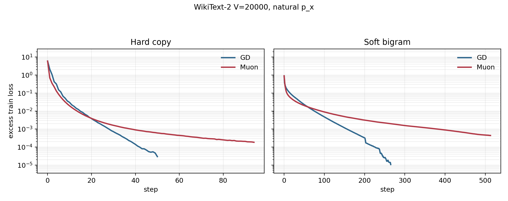
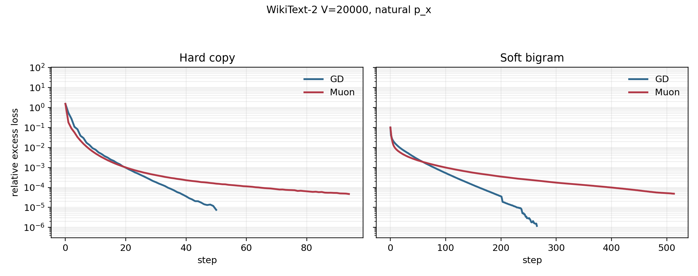
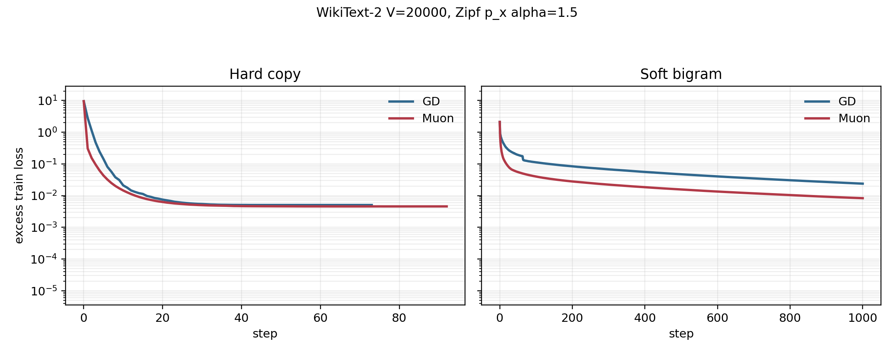
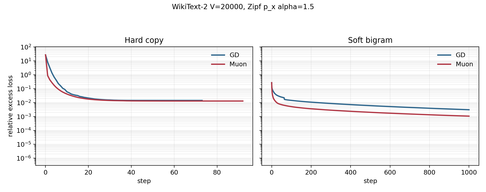
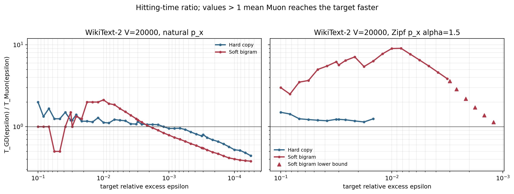

# WikiText Same-Dimension Experiment

本仓库记录 WikiText-2 上的 same-dimension(N,d) soft-vs-hard 条件分布实验。
实验的核心问题是：在同一个线性 softmax 模型、同一个词表规模、同一个维度、同一个随机表示和同一个输入边缘分布 `pi_x` 下，仅改变条件分布 `p(y|x)`，GD 和 Muon 的优化表现会如何变化？

我们比较两类任务：

- `hardcopy`：确定性 hard-copy 任务，每个上下文 `x` 的目标 token 为 `y = x`。
- `soft`：真实 WikiText-2 bigram 条件分布，同一个上下文 `x` 可以对应多个后继 token `y`。

实验包含两个输入边缘分布 setting：

- natural `pi_x`：使用 WikiText-2 bigram 中自然出现的上下文频率。
- Zipf `pi_x` 1.5：使用 Zipf 分布作为上下文频率，指数 `alpha = 1.5`，同时保留 WikiText-2 的 soft conditional 结构。

## 仓库结构

```text
.
├── README.md
└── figures
    ├── hitting_time_ratio_combined.png
    ├── natural_pi_x
    │   ├── excess_loss_aligned_y.png
    │   └── relative_excess_loss_aligned_y.png
    └── zipf_pi_x_alpha_1_5
        ├── excess_loss_aligned_y.png
        └── relative_excess_loss_aligned_y.png
```

每个 setting 保留两张主图：

- `excess_loss_aligned_y.png`：完整 horizon 上的 excess loss。
- `relative_excess_loss_aligned_y.png`：完整 horizon 上的 relative excess loss。

另外，`figures/hitting_time_ratio_combined.png` 汇总两个 setting 的 hitting-time ratio。

## Problem Setup

令词表大小为 `V`，上下文 token 为 `x`，目标 token 为 `y`。实验使用一个低维线性 softmax 模型。

每个 token 有两个固定随机表示：

- context representation：`e_x in R^d`
- output representation：`u_y in R^d`

训练变量是矩阵：

```text
W in R^{d x d}
```

给定上下文 `x` 时，模型对目标 `y` 的 logit 为：

```text
z_y(x; W) = u_y^T W e_x + b_y
```

本实验使用 zero bias：

```text
b_y = 0
```

于是模型条件分布为：

```text
q_W(y | x) = softmax_y(z_y(x; W))
```

训练目标是加权 cross entropy：

```text
L(W) = E_{x ~ pi_x} [ CE(p(.|x), q_W(.|x)) ]
```

也就是：

```text
L(W)
= sum_x pi_x [
    log sum_y exp(z_y(x; W))
    - sum_y p(y|x) z_y(x; W)
  ].
```

实验中 smoothing 参数为：

```text
rho = 0
```

因此目标分布完全由对应 setting 的 `p(y|x)` 给出，不额外混入 unigram smoothing。

## Hardcopy vs Soft Conditional

实验固定 `pi_x`，只改变 `p(y|x)`。

### Hardcopy

hardcopy 条件分布是确定性的：

```text
p_hard(y | x) = 1[y = x].
```

这对应 associative-memory 风格的复制任务。对每个上下文 token，模型只需要把概率集中到同编号目标 token。

### Soft WikiText Bigram

soft 条件分布来自 WikiText-2 train split 的 bigram 统计：

```text
p_soft(y | x) = count(x, y) / count(x).
```

一个上下文 `x` 可以有多个后继 token。这个 setting 保留自然语言 bigram 的多目标、不确定性和长尾条件结构。

## 两个 `pi_x` Setting

### Setting A：natural `pi_x`

natural `pi_x` 使用 WikiText-2 train split 中的经验上下文频率：

```text
pi_x = count(x) / total_bigrams.
```

原始实验标识：

```text
wikitext2_v20000
```

数据统计：

| quantity | value |
|---|---:|
| Vocabulary size | `20000` |
| Raw unique tokens | `33278` |
| Total bigrams | `2088627` |
| Active contexts | `20000` |
| Active targets | `20000` |
| Soft nnz bigrams | `544854` |
| Hardcopy nnz bigrams | `20000` |
| Soft conditional entropy | `4.404451` nats |
| Soft conditional perplexity | `81.814215` |
| Hardcopy conditional entropy | `0` nats |
| Hardcopy conditional perplexity | `1` |

### Setting B：Zipf `pi_x`, `alpha = 1.5`

Zipf setting 把输入边缘分布替换为：

```text
pi_x ∝ rank(x)^(-1.5),  rank(x) = 1, 2, ..., V.
```

归一化后：

```text
sum_x pi_x = 1.
```

soft 条件分布仍来自 WikiText-2 bigram 的 `p_soft(y|x)`，但每个上下文的权重改成 Zipf `pi_x`。hardcopy 条件仍为 `y=x`，并使用同一个 Zipf `pi_x`。

原始实验标识：

```text
wikitext2_v20000_zipf1p5
```

数据统计：

| quantity | value |
|---|---:|
| Vocabulary size | `20000` |
| Total bigrams weight | `2088627` |
| Active contexts | `20000` |
| Active targets | `20000` |
| Soft nnz bigrams | `544854` |
| Hardcopy nnz bigrams | `20000` |
| Zipf alpha | `1.5` |
| `pi_x` max | `0.3848768952` |
| `pi_x` min | `1.360745312e-07` |
| Soft conditional entropy | `5.177276` nats |
| Soft conditional perplexity | `177.199414` |
| Hardcopy conditional entropy | `0` nats |
| Hardcopy conditional perplexity | `1` |

## 共同实验参数

两个 setting 中，hardcopy 和 soft 共享下列模型和优化参数：

| parameter | value |
|---|---:|
| Corpus | WikiText-2 |
| Vocabulary size | `V = 20000` |
| Dimension | `d = 128` |
| Train split | `train` |
| Representation seed | `0` |
| Random representation normalization | enabled |
| Bias | zero |
| Smoothing | `rho = 0` |
| Dtype | `float32` |
| Max steps | `1000` |
| Record frequency | every step |
| Batch mode | full batch |
| Optimizers | GD, Muon/spectral |
| Step-size selection | exact line search |
| Line-search method | derivative bisection |
| Line-search bracket batch points | `8` |
| Line-search refine points | `8` |
| Line-search iterations | `12` |
| Line-search max step cap | `1e8` |
| Plateau stop | enabled |
| Zero-update stop | enabled |

## Optimizers

每一步先计算 full-batch gradient：

```text
G_t = grad L(W_t).
```

代码中使用 `neg_grad = -G_t` 表示下降方向的基础量。

### GD

GD 使用负梯度方向：

```text
D_t^GD = -G_t.
```

更新为：

```text
W_{t+1} = W_t + alpha_t D_t^GD.
```

其中 `alpha_t` 由 exact line search 决定。

### Muon / Spectral

Muon/spectral 使用负梯度的 polar factor 作为方向。记：

```text
-G_t = U Sigma V^T.
```

则方向为：

```text
D_t^Muon = U V^T.
```

更新为：

```text
W_{t+1} = W_t + alpha_t D_t^Muon.
```

这里的比较重点是方向几何差异，而不是手动调学习率差异；两个优化器都使用同一套 exact line search 框架。

## Exact Line Search

每一步固定方向 `D_t`，在线上最小化：

```text
phi(alpha) = L(W_t + alpha D_t),  alpha >= 0.
```

实验使用 derivative-bisection line search：

1. 从初始 step size 开始寻找 bracket。
2. 沿方向批量评估多个候选 `alpha`。
3. 寻找 `phi'(alpha)` 从负到非负的区间。
4. 用多点 refine 缩小区间。
5. 接受使 loss 下降或在数值容忍范围内持平的候选步长。

这避免把结果解释成某个固定 learning rate 的偶然现象。

## Metrics

### Train Loss

训练损失就是上面定义的：

```text
L(W) = E_{x ~ pi_x} [ CE(p(.|x), q_W(.|x)) ].
```

### Reference Minimum `L*`

对每个 condition 单独计算数值参考最优值 `L*`。实验中使用 L-BFGS strong-Wolfe 求得参考 minimum，并在 plotting 阶段用于计算 excess loss。

注意：`hardcopy` 和 `soft` 是不同目标函数，因此它们的 `L*` 不相同。

### Excess Loss

```text
excess_loss_t = L(W_t) - L*.
```

图中展示的是 full horizon 的 aligned-y 版本。

### Relative Excess Loss

```text
relative_excess_loss_t = (L(W_t) - L*) / |L*|.
```

relative excess loss 用来把不同 absolute loss 尺度的曲线放在更可比较的尺度上。

### Hitting Time

给定 threshold `epsilon`，hitting time 定义为第一次达到目标精度的 step：

```text
T_optimizer(epsilon)
= min { t : relative_excess_loss_t <= epsilon }.
```

combined hitting-time 图展示：

```text
T_GD(epsilon) / T_Muon(epsilon).
```

因此：

- ratio `> 1`：Muon 更快达到该 threshold。
- ratio `< 1`：GD 更快达到该 threshold。
- 图中横轴是目标 relative excess threshold `epsilon`。

## Results: Natural `pi_x`

这个 setting 对应真实 WikiText-2 上下文频率。

### Final Metrics

| condition | optimizer | L* | final loss | final excess | final relative excess | best relative excess |
|---|---:|---:|---:|---:|---:|---:|
| hardcopy | GD | 3.9047025 | 3.9047319 | 2.948e-05 | 7.551e-06 | 7.551e-06 |
| hardcopy | Muon | 3.9047025 | 3.9048867 | 0.0001843 | 4.72e-05 | 4.72e-05 |
| soft | GD | 8.9969836 | 8.9969943 | 1.068e-05 | 1.187e-06 | 1.187e-06 |
| soft | Muon | 8.9969836 | 8.9974229 | 0.0004393 | 4.882e-05 | 4.882e-05 |

### Relative Excess Hitting Steps

| condition | optimizer | <= 0.1 | <= 0.03 | <= 0.01 | <= 0.003 | <= 0.001 | <= 0.0003 | <= 0.0001 |
|---|---|---:|---:|---:|---:|---:|---:|---:|
| hardcopy | GD | 4 | 6 | 9 | 15 | 20 | 28 | 34 |
| hardcopy | Muon | 2 | 5 | 8 | 13 | 21 | 35 | 65 |
| soft | GD | 1 | 3 | 17 | 46 | 79 | 120 | 161 |
| soft | Muon | 1 | 3 | 8 | 38 | 100 | 220 | 399 |

### Excess Loss



### Relative Excess Loss



## Results: Zipf `pi_x`, `alpha = 1.5`

这个 setting 使用 Zipf 上下文边缘分布，并保留 WikiText-2 soft conditional 结构。

### Final Metrics

| condition | optimizer | L* | final loss | final excess | final relative excess | best relative excess |
|---|---:|---:|---:|---:|---:|---:|
| hardcopy | GD | 0.35157442 | 0.35663193 | 0.005058 | 0.01439 | 0.01438 |
| hardcopy | Muon | 0.35157442 | 0.35614251 | 0.004568 | 0.01299 | 0.01298 |
| soft | GD | 7.7853765 | 7.8092147 | 0.02384 | 0.003062 | 0.003062 |
| soft | Muon | 7.7853765 | 7.7936689 | 0.008292 | 0.001065 | 0.001065 |

### Relative Excess Hitting Steps

空白表示该 optimizer 在记录的 horizon 内没有达到对应 threshold。

| condition | optimizer | <= 0.1 | <= 0.03 | <= 0.01 | <= 0.003 | <= 0.001 | <= 0.0003 | <= 0.0001 |
|---|---|---:|---:|---:|---:|---:|---:|---:|
| hardcopy | GD | 9 | 16 |  |  |  |  |  |
| hardcopy | Muon | 6 | 13 |  |  |  |  |  |
| soft | GD | 3 | 34 | 234 |  |  |  |  |
| soft | Muon | 1 | 6 | 26 | 277 |  |  |  |

### Excess Loss



### Relative Excess Loss



## Combined Hitting-Time Ratio

这张图把 natural `pi_x` 和 Zipf `pi_x` 1.5 两个 setting 放在一起，分别比较 hardcopy 和 soft 条件下：

```text
T_GD(epsilon) / T_Muon(epsilon).
```



## 如何阅读结果

从最终指标看：

- 在 natural `pi_x` setting 中，GD 在 very low final relative excess 上更强；Muon 在部分早期 threshold 上更快，但后期 threshold 不一定更快。
- 在 Zipf `pi_x` 1.5 setting 中，Muon 在 hardcopy 和 soft 两个 condition 下都取得更低 final relative excess。
- 在 Zipf soft condition 中，Muon 的 advantage 更明显：final relative excess 从 GD 的 `0.003062` 降到 Muon 的 `0.001065`。

从 hitting-time 看：

- ratio 曲线大于 `1` 的区域表示 Muon 更快。
- ratio 曲线小于 `1` 的区域表示 GD 更快。
- 不同 threshold 下的速度关系可能改变，因此 hitting-time 图比单个 final loss 数字更能展示优化过程。

## Reproducibility Notes

实验由以下流程生成：

1. 从 WikiText-2 train split 构造 `V=20000` 的 bigram soft dataset。
2. 使用同一组 context counts 构造 hardcopy dataset。
3. 从 natural WikiText `pi_x` 重加权得到 Zipf `pi_x` 1.5 setting。
4. 对每个 setting 和 condition 运行 GD exact line search 与 Muon/spectral exact line search。
5. 用 L-BFGS strong-Wolfe 计算每个 condition 的 reference minimum `L*`。
6. 根据 `L*` 计算 excess loss、relative excess loss 和 hitting time。
7. 生成 full-horizon aligned-y figures 与 combined hitting-time ratio figure。

所有结果均为单 seed：

```text
seed = 0
```
